# SplitIt

SplitIt is a finance management application that simplifies the process of adding bills and splitting expenses among group members. It offers advanced features for validation, user authentication, and settling balances, making it an ideal tool for managing shared finances within a group.

## Features

- **User Authentication**: SplitIt provides user registration and login functionalities to ensure secure access to your finance management account.

- **Bill Management**: Users can easily add, edit, and delete bills. Each bill can be associated with a description, amount, and the members involved in the expense.

- **Expense Splitting**: SplitIt calculates how much each member owes or is owed based on the bills and the members involved. It simplifies the process of dividing expenses evenly among group members.

- **Balance Settlement**: Users can settle balances among group members, making it easy to track who owes money and who is owed.

- **Validation**: SplitIt incorporates validation mechanisms to ensure that the bills and expenses are correctly input and that calculations are accurate.

## Technologies Used

- **Frontend (Angular)**: The frontend of SplitIt is built using Angular, a popular web application framework. Angular provides a robust structure for building dynamic and responsive user interfaces.

- **Backend (Node.js with Express)**: The backend of SplitIt is powered by Node.js, a server-side JavaScript runtime, and Express, a web application framework for Node.js. Together, they handle the server-side logic and API endpoints for the application.

- **MongoDB**: SplitIt uses MongoDB, a NoSQL database, to store and manage data. MongoDB's flexibility and scalability make it a suitable choice for handling financial data.

- **JWT (JSON Web Tokens)**: JWT is used for user authentication and authorization in SplitIt. It provides secure and efficient access control to the application.

## Setup Instructions

### Frontend (Angular)

- Navigate to the frontend directory:
   ```bash
   cd splitIt-app
- Install dependencies:
   ```bash
   npm install
- Start the Angular development server:
   ```bash
   ng serve
Open your browser and go to http://localhost:4200 to access the SplitIt frontend.

### Backend (Node.js with Express)

- Navigate to the backend directory:
   ```bash
   cd server
- Install dependencies:
   ```bash
   npm install
- Configure the MongoDB connection in server.js file in following code
    ```bash
    mongoose.connect('mongodb://127.0.0.1:27017/SplitIt', {
    useNewUrlParser: true,
    useUnifiedTopology: true,
    });
    ```
- Start server:
   ```bash
   node server.js

Test the server's API by making requests to http://localhost:3000 using Postman or any other suitable endpoint testing platform.

# Future Steps and Improvements

SplitIt is an ongoing project, and there are several potential improvements and future steps:

- **User Roles**: Implement different user roles (e.g., admin, regular user) to control access and permissions.

- **Security**: Enhance security by implementing user authentication.

- **Notifications**: Add email or in-app notifications to keep users informed about their financial activities.

- **Expense Categories**: Allow users to categorize expenses for better tracking.

- **Expense Modifications**: Allow users to modify expenses and resolve balances based on that.

- **Reports and Analytics**: Create visual reports and analytics for a better understanding of spending patterns.

Please feel free to contribute to the project or provide feedback to help us make SplitIt even better!

Thank you for using SplitIt!

## Snap Shots

1. Register Page 

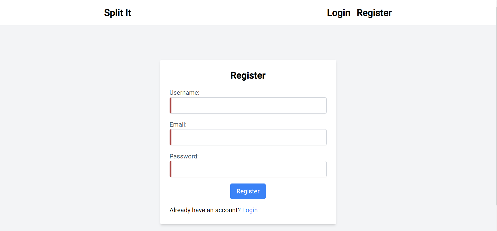

2. Register Validations 

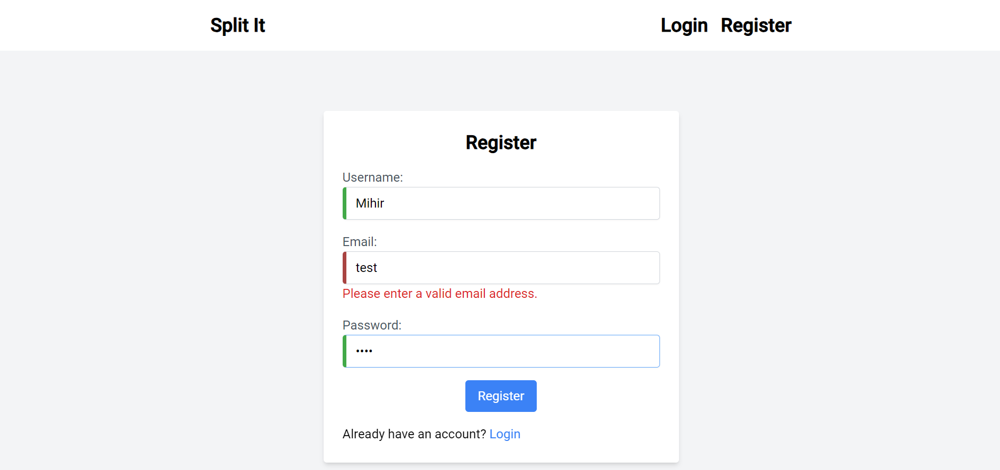

3. Register Validations Ok

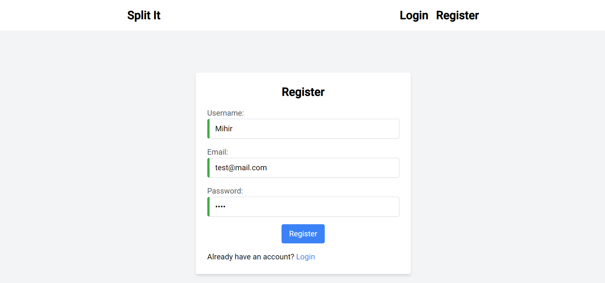

4. Login Page 

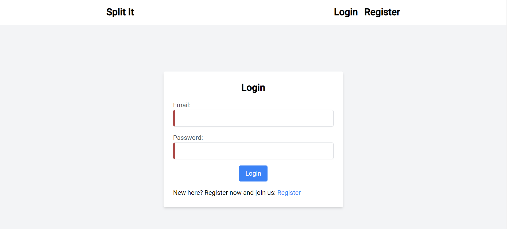

5. Login Validations 

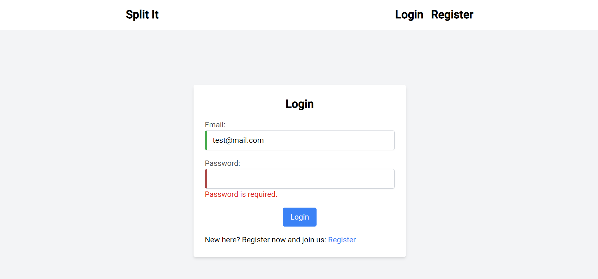

6. Login Validations Ok

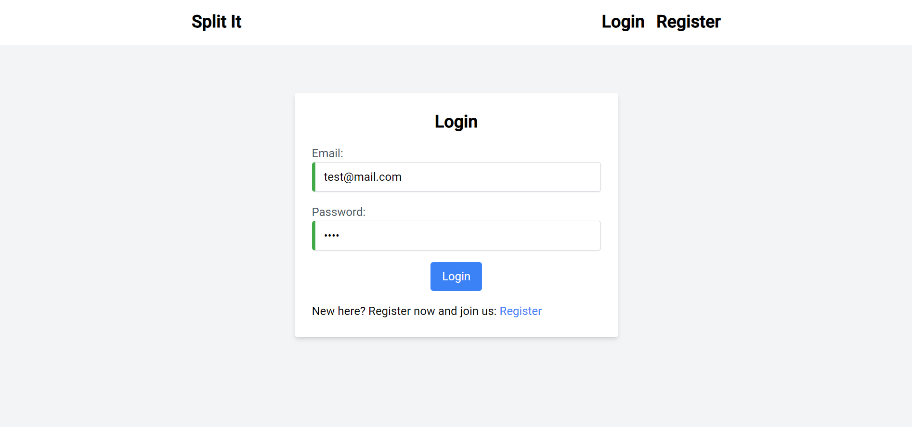

7. Home 

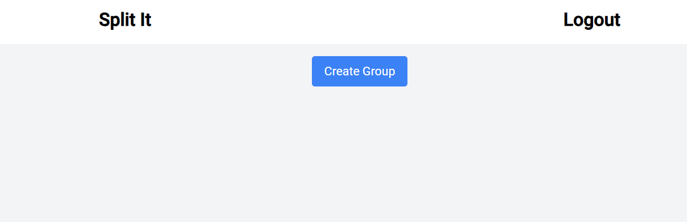

8. Create Group

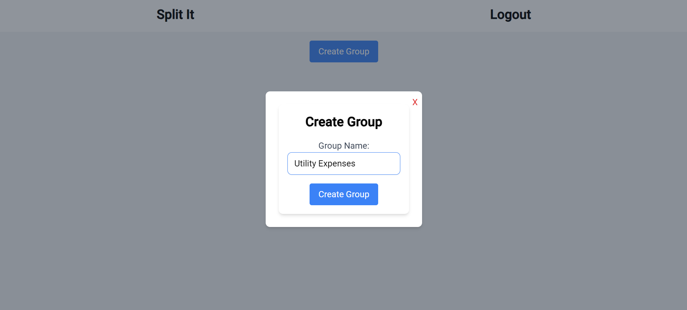

9. Group

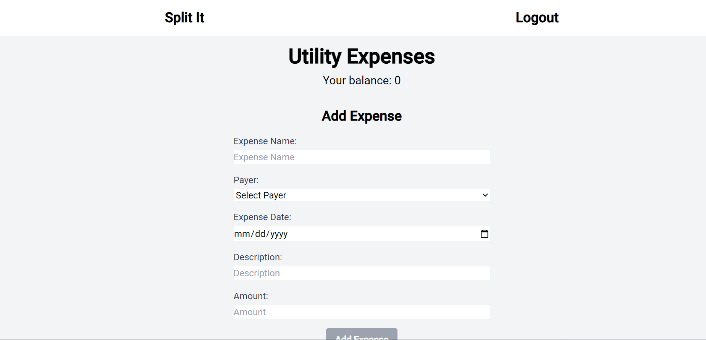

10. Group

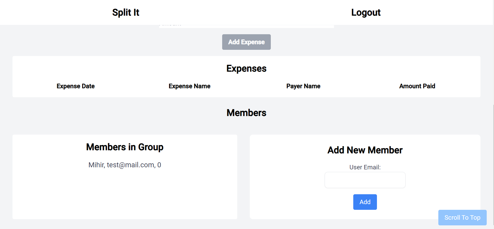

11. Member Validations

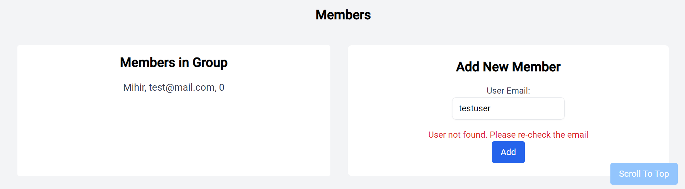

12. Member Added

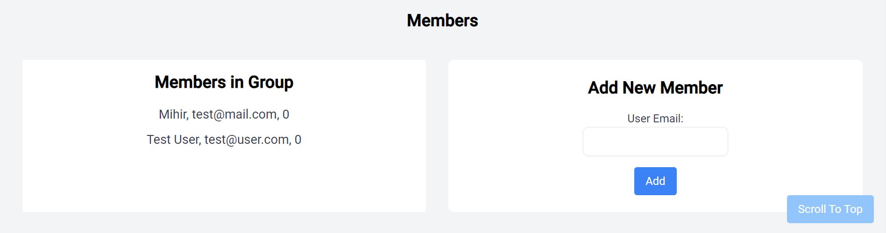

13. Expense

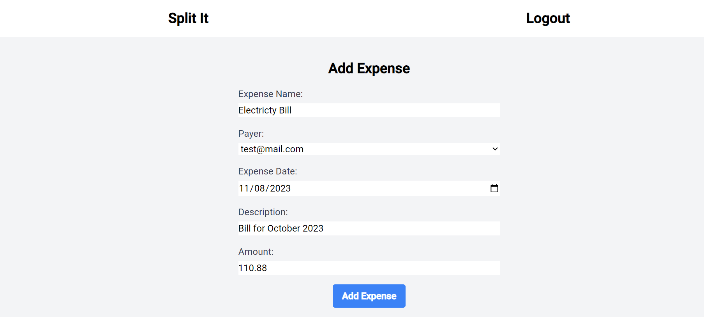

14. Member Splits

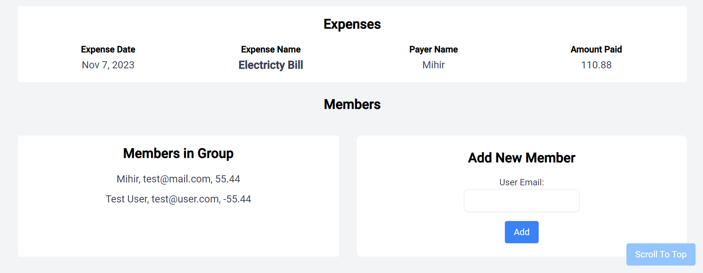

15. Group Balance


16. Expense Multiple User

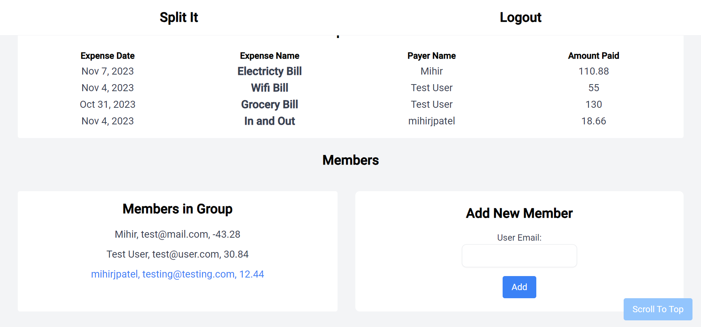

17. Group Balance Multiple User

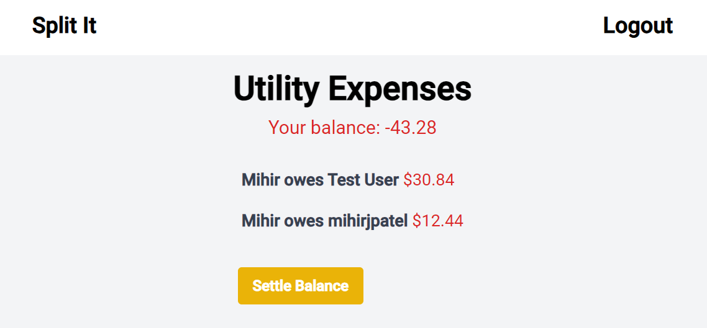

18. Settle Balance

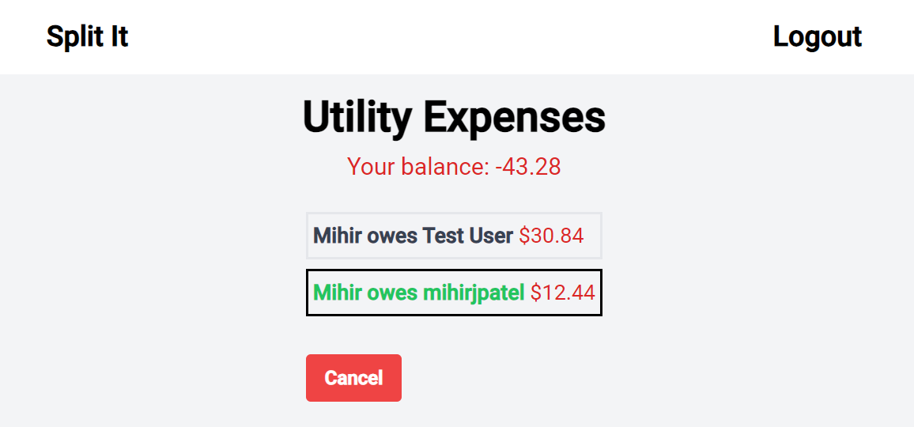

19. Settle Balance Confirmation

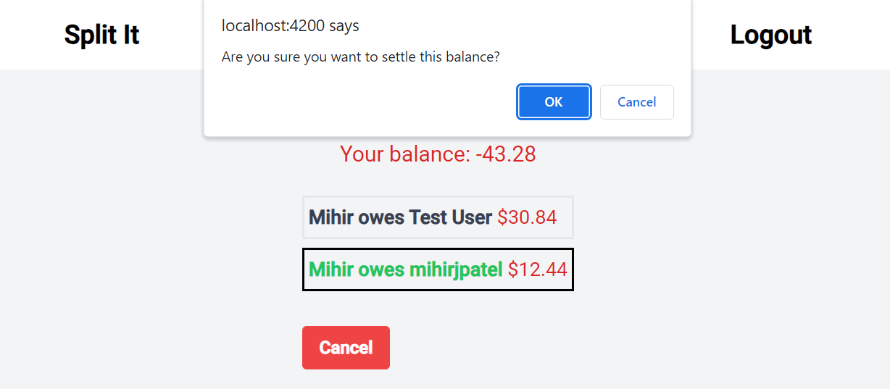

20. Settled Balance

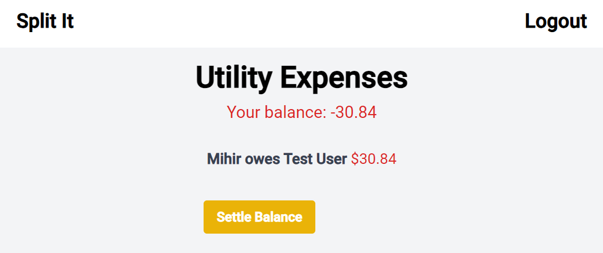

21. Member Settled Balance

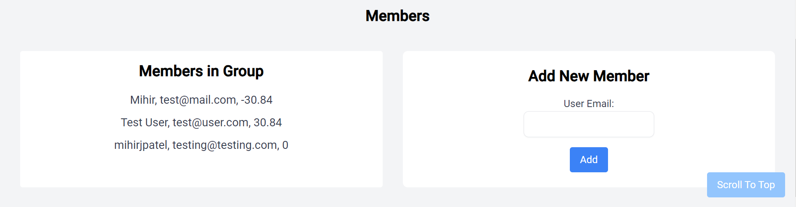

22. Home Group List

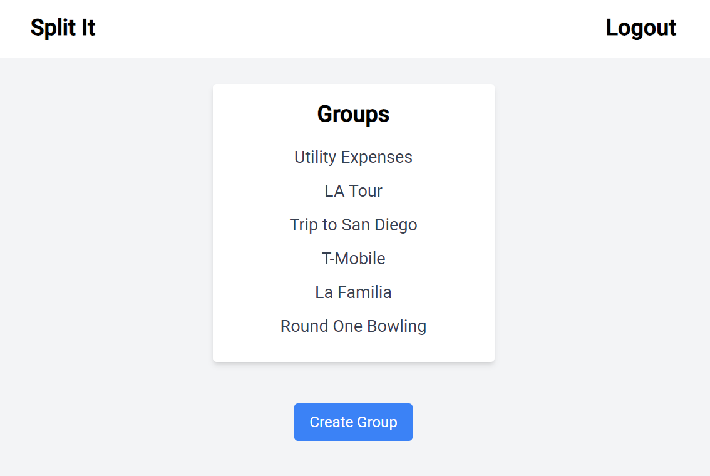